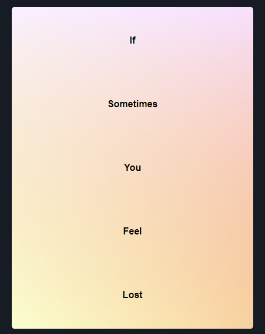
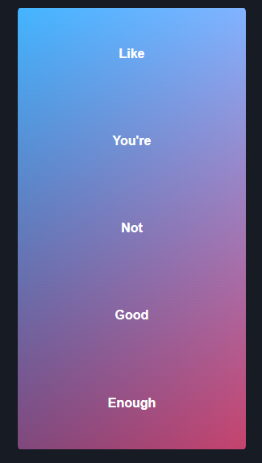

# If Sometimes You Feel Lost

## HTML/CSS Project - practice the basics of responsive, mobile-first design

# Project Goals
The primary goal of this project is to build a responsive web page using HTML and CSS. The page will be developed using mobile-first design.

The secondary goal of this project is to motivate myself and others who may be feeling overwhelmed whilst learning the tools necessary to enter the tech industry as professionals.
I hope to implement an eye-catching aesthetic using HTML and pure CSS techniques to demonstrate a range of effects that can be achieved without knowing any JavaScript whatsoever, and also that the content may motivate anyone who comes across it if they are in a relatable situation.

# User Stories
From the perspective of the user:

- As someone with multiple devices, I want to be able to view the web page on any of my devices
- As someone learning to develop web pages, I want an example of what can be achieved using only HTML and CSS
- As someone trying to enter the tech industry as a professional, I want to relate to others who are tackling the same challenges

From the perspective of the developer:

- As a beginner developer, I want to practice mobile-first, responsive design
- As a beginner developer, I want to practice HTML to develop my skills
- As a beginner developer, I want to practice CSS to develop my skills

# Design Choices
The page is structured as a number of `article` elements nested inside a `section` element.

The `section` element places the nested `article` elements into a grid, specifying that the column will be responsive (min 320px, max 33% vw).

- CSS features common to most `article` elements:
    - flexbox
    - boxsizing
    - transitions
    - border radius
    - :hover
    - padding

- CSS features of individual `article` elements:
    - 1. 'Pink Glow'
        - linear-gradient
        - background-blend-mode
        - animation (@keyframes)

    - 2. 'Disappear'
        - opacity
        - text-decoration

    - 3. 'Breathe'
        - transform: translateY()
        - animation (@keyframes)
        - font-weight
        - font-family
    
    - 4. 'Greyscale'
        - background-image
        - background-size
        - filter

    - 5. 'Neon'
        - transition-delay
        - :nth-child()
        - filter

    - 6. 'Portal'
        - box-shadow
        - :nth-child()
        - font-size
    
    - 7. 'Flip-card'
        - perspective
        - transform: rotateY()
        - transform-style
        - position
        - backface-visibility
    
    - 8. 'Explosion'
        - grid-template-areas
        - grid-area
        - transform: translate(x,y)
        - cubic-bezier (transition)
        - overflow
    
Finally there is a border on the <section> element, designed to draw the eye downwards along with the flow of the <article> elements.

# 